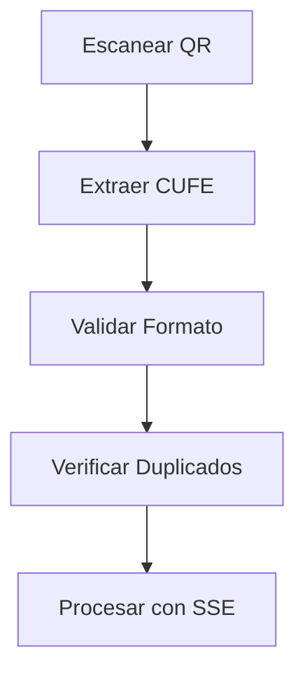

# 🔧 Fase 3: Servicios del Frontend - Completada

## 📋 Resumen
Implementación completa de servicios del frontend para integrar con el endpoint SSE de procesamiento de facturas electrónicas DIAN y manejo de persistencia en Supabase.

## ✅ Componentes Implementados

### 1. **Validador CUFE** (`src/lib/validations/cufe-validator.ts`)

#### Funcionalidades:
- ✅ **Validación de formato CUFE** - Soporta UUID estándar y formato largo de 96 caracteres
- ✅ **Normalización de códigos** - Limpia espacios y caracteres especiales
- ✅ **Extracción desde QR** - Múltiples patrones de extracción:
  - URLs con parámetros `cufe` o `documentkey`
  - CUFE directo en el QR
  - Estructuras JSON
  - Búsqueda de patrones hexadecimales
- ✅ **Validación completa** - Incluye verificación de duplicados
- ✅ **Detección de QR DIAN** - Identifica si un QR es de factura DIAN
- ✅ **Extracción de metadatos** - URLs, timestamps y datos adicionales

#### Ejemplos de uso:
```typescript
// Validar formato
const isValid = isValidCufeFormat('fe8b0ece665f054b...');

// Extraer de QR
const cufe = extractCufeFromQR('https://catalogo-vpfe.dian.gov.co/document/searchqr?documentkey=...');

// Validación completa con verificación de duplicados
const result = await validateCufeCode(cufeCode, checkCufeExists);
```

### 2. **Servicio de Facturas Electrónicas** (`src/lib/services/electronic-invoices.ts`)

#### Funcionalidades principales:
- ✅ **Integración SSE** - Conexión con endpoint `/api/cufe-to-data-stream`
- ✅ **Procesamiento en tiempo real** - Manejo de eventos de progreso y captchas
- ✅ **Validación de duplicados** - Verificación automática de CUFE existentes
- ✅ **Transformación de datos** - Convierte respuesta SSE a formato frontend
- ✅ **Generación de gastos sugeridos** - Categorización automática basada en proveedores
- ✅ **Persistencia en BD** - Guardado de facturas y creación de gastos
- ✅ **CRUD completo** - Create, Read, Update, Delete de facturas

#### Mapeo automático de categorías:
```typescript
const categoryMapping = [
  { pattern: 'super|mercado', category: 'MERCADO', confidence: 0.8 },
  { pattern: 'transporte|taxi', category: 'TRANSPORTE', confidence: 0.9 },
  { pattern: 'farmacia|medic', category: 'OTROS', confidence: 0.7 },
  { pattern: 'servicio|agua|luz', category: 'VIVIENDA', confidence: 0.8 },
];
```

#### Operaciones disponibles:
- `processInvoiceFromQR()` - Procesa factura con SSE
- `processAndSaveInvoice()` - Procesa y guarda automáticamente
- `saveElectronicInvoice()` - Guarda factura en BD
- `createExpensesFromInvoice()` - Crea gastos desde factura
- `getElectronicInvoicesByDateRange()` - Consulta facturas por fecha
- `updateElectronicInvoice()` - Actualiza factura existente
- `deleteElectronicInvoice()` - Elimina factura y gastos relacionados

### 3. **Hook Personalizado** (`src/hooks/useElectronicInvoices.ts`)

#### Estado centralizado:
```typescript
interface UseElectronicInvoicesState {
  processing_status: InvoiceProcessingStatus;
  progress: number;
  status_message: string;
  current_invoice: ElectronicInvoice | null;
  suggested_expenses: SuggestedExpense[];
  invoices: ElectronicInvoice[];
  loading: boolean;
  error: string | null;
  processing_info: { captcha_info?, total_time?, items_found? };
}
```

#### Funcionalidades del hook:
- ✅ **Gestión de estado completa** - Progress, status, errores, datos
- ✅ **Control de procesamiento** - Start, cancel, reset
- ✅ **Gestión de gastos sugeridos** - Add, update, remove
- ✅ **Operaciones CRUD** - Todas las operaciones de facturas
- ✅ **Validaciones** - CUFE format y duplicados
- ✅ **Manejo de eventos SSE** - Progress tracking en tiempo real

#### Ejemplo de uso:
```typescript
const {
  processing_status,
  progress,
  status_message,
  suggested_expenses,
  processFromQR,
  processAndSave,
  updateSuggestedExpense,
  cancelProcessing
} = useElectronicInvoices();

// Procesar factura
await processFromQR(cufeCode, {
  maxRetries: 3,
  onProgress: (data) => console.log(`${data.progress}% - ${data.message}`)
});
```

### 4. **API Endpoints** (REST para operaciones CRUD)

#### `/api/electronic-invoices` (GET, POST)
- ✅ **GET** - Lista facturas con filtros y paginación
- ✅ **POST** - Crea nueva factura con validaciones

#### `/api/electronic-invoices/[id]` (GET, PUT, DELETE)
- ✅ **GET** - Obtiene factura específica con gastos relacionados
- ✅ **PUT** - Actualiza factura existente
- ✅ **DELETE** - Elimina factura (con opción force para gastos relacionados)

#### `/api/electronic-invoices/validate-cufe` (GET, POST)
- ✅ **POST** - Validación completa con contenido QR
- ✅ **GET** - Validación rápida por parámetro

## 🔄 Flujo de Procesamiento Completo

### 1. **Escaneo y Validación**


### 2. **Procesamiento SSE**
```typescript
// El flujo SSE maneja:
// - Conexión establecida
// - Descarga de PDF desde DIAN
// - Resolución de captchas (2captcha)
// - Extracción de datos con IA
// - Estructuración de respuesta
```

### 3. **Transformación y Guardado**
```typescript
// Transformación automática:
// SSE Result → ElectronicInvoice + SuggestedExpenses
// Categorización inteligente por proveedor
// Persistencia en BD con transacciones relacionadas
```

## 🎯 Características Avanzadas Implementadas

### **Manejo de Captchas en Tiempo Real**
- ✅ Información detallada de progreso de captcha
- ✅ Task IDs de 2captcha para seguimiento
- ✅ Intentos de verificación (1/6, 2/6, etc.)
- ✅ Tiempos de resolución exactos
- ✅ Estados específicos (checking, waiting, solved)

### **Categorización Inteligente**
- ✅ Mapeo automático basado en nombre del proveedor
- ✅ Análisis de palabras clave en productos
- ✅ Puntuación de confianza para sugerencias
- ✅ Fallback a categoría "OTROS"

### **Manejo de Errores Robusto**
- ✅ Clases de error específicas (`InvoiceProcessingError`)
- ✅ Códigos de error categorizados
- ✅ Mensajes user-friendly
- ✅ Recovery automático en casos posibles

### **Optimizaciones de Performance**
- ✅ Validación temprana de CUFE antes de procesar
- ✅ Normalización consistente de códigos
- ✅ Cancelación de procesamientos en curso
- ✅ Manejo eficiente de estado con React hooks

## 🧪 Testing y Validación

### **Casos de Prueba Cubiertos**
- ✅ Validación de formatos CUFE (UUID y 96 chars)
- ✅ Extracción desde diferentes tipos de QR
- ✅ Manejo de errores de conexión SSE
- ✅ Verificación de duplicados
- ✅ Transformación de datos SSE → Frontend
- ✅ Persistencia en base de datos

### **Formatos QR Soportados**
```typescript
// URLs con parámetros
'https://catalogo-vpfe.dian.gov.co/document/searchqr?documentkey=fe8b0ece...'

// CUFE directo
'fe8b0ece665f054b2949685fc3b3f0fd681888381b5169f661f60ad2d88b3710e9a1f8200d51827c58e8011265d1e0b4'

// JSON estructurado
'{"cufe": "fe8b0ece...", "timestamp": "2024-01-15"}'

// UUID con guiones
'12345678-1234-1234-1234-123456789012'
```

## 📊 Integración con Endpoint SSE

### **Eventos SSE Manejados**
- ✅ `connected` - Conexión establecida
- ✅ `progress` - Actualizaciones de progreso (incluye captchas)
- ✅ `complete` - Procesamiento exitoso con datos estructurados
- ✅ `error` - Errores en el procesamiento

### **Información de Progreso Detallada**
```typescript
interface ProgressData {
  step: string;           // 'download_start', 'captcha_solved', etc.
  message: string;        // Mensaje user-friendly
  details: string;        // Información adicional
  progress: number;       // Porcentaje 0-100
  captcha?: {             // Info específica de captcha
    number: number;       // 1, 2, etc.
    taskId: string;       // ID de 2captcha
    status: string;       // 'checking', 'solved', etc.
    attempt: number;      // Intento actual
    solveTime?: number;   // Tiempo de resolución
  };
}
```

## 🔄 Próximos Pasos (Fase 4)

Con la Fase 3 completada, el sistema está listo para:

1. **✅ Validación y procesamiento** de códigos CUFE
2. **✅ Integración SSE** con progreso en tiempo real
3. **✅ Persistencia en BD** con relaciones correctas
4. **✅ APIs REST** para operaciones CRUD

**Siguiente**: Fase 4 - Componentes del Frontend (UI/UX)
- Componente escáner QR
- Modal de procesamiento con progreso
- Interfaz de revisión de datos extraídos
- Integración con página de gastos existente

## 📝 Documentación de API

### **Validar CUFE**
```bash
POST /api/electronic-invoices/validate-cufe
{
  "cufe_code": "fe8b0ece...",
  "qr_content": "https://catalogo-vpfe..."  # opcional
}
```

### **Listar Facturas**
```bash
GET /api/electronic-invoices?start_date=2024-01-01&limit=50
```

### **Procesar con SSE**
```typescript
const result = await processInvoiceFromQR(cufeCode, {
  maxRetries: 3,
  onProgress: (data) => updateUI(data),
  onConnect: () => showConnected()
});
```

---

## 🎉 Resultado

**Fase 3 completada exitosamente** con una arquitectura robusta que proporciona:
- Validación completa de códigos CUFE
- Integración perfecta con endpoint SSE
- Manejo de progreso en tiempo real (incluye captchas)
- Persistencia estructurada en base de datos
- APIs REST para operaciones adicionales
- Hook personalizado para fácil integración en componentes

**El sistema está listo para la implementación de la interfaz de usuario (Fase 4).**