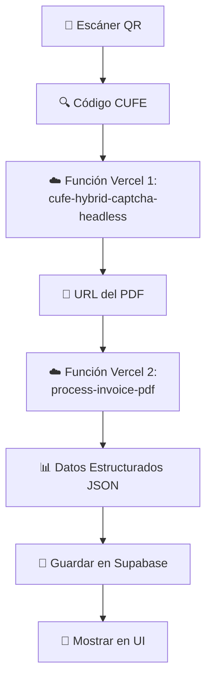

# 🔗 Guía de Integración: Facturas Electrónicas DIAN

## 📋 Resumen del Sistema

Tu proyecto actual ya tiene implementada la **Parte 1** del sistema:
- ✅ **Función CUFE → URL del PDF** (cufe-hybrid-captcha-headless.js)

Ahora agregamos la **Parte 2**:
- 🆕 **Función URL/CUFE → Datos Estructurados** (process-invoice-pdf.ts)

## 🏗️ Arquitectura del Sistema



---

## ⚙️ Configuración e Integración

### 1. Variables de Entorno Necesarias

En tu proyecto Vercel, agrega estas variables:

```bash
# Función CUFE existente
CAPTCHA_API_KEY=tu_2captcha_api_key

# Nueva función de procesamiento
CUFE_API_URL=https://tu-proyecto-cufe.vercel.app/api/cufe-hybrid-captcha-headless

# Base de datos (en el proyecto del presupuesto)
NEXT_PUBLIC_SUPABASE_URL=tu_supabase_url
NEXT_PUBLIC_SUPABASE_ANON_KEY=tu_supabase_key
```

### 2. Dependencias para la Nueva Función

```json
{
  "dependencies": {
    "pdf-parse": "^1.1.1",
    "@types/pdf-parse": "^1.1.1"
  }
}
```

### 3. Estructura de Archivos Sugerida

```
/api
├── cufe-hybrid-captcha-headless.js ✅ (Ya existe)
├── cufe-playwright-captcha.js ✅ (Ya existe)  
├── process-invoice-pdf.ts 🆕 (Nueva función)
└── health.js ✅ (Ya existe)
```

---

## 🔧 Opciones de Implementación

### **Opción A: Proyectos Separados (Recomendado)**

**Ventajas:**
- ✅ Especialización: CUFE en un proyecto, Presupuesto en otro
- ✅ Escalabilidad independiente
- ✅ Menor complejidad en cada proyecto

**Estructura:**
```
Proyecto 1: FacturaDian (Tu proyecto actual)
├── /api/cufe-hybrid-captcha-headless.js
├── /api/process-invoice-pdf.ts (Nueva)
└── /api/health.js

Proyecto 2: Presupuesto (Proyecto principal)
├── /src/api/electronic-invoices.ts (Cliente)
└── Componentes UI + Base de datos
```

### **Opción B: Proyecto Unificado**

**Ventajas:**
- ✅ Todo en un lugar
- ✅ Menos configuración

**Desventajas:**
- ❌ Mezcla funcionalidad general con específica del presupuesto

---

## 📡 Flujo de Comunicación entre Funciones

### **Flujo Completo desde QR a Datos**

```javascript
// En el frontend (proyecto presupuesto)
async function processInvoiceFromQR(cufeCode) {
  try {
    // Paso 1: Obtener PDF usando tu función existente
    const cufeResponse = await fetch('https://tu-cufe-api.vercel.app/api/cufe-hybrid-captcha-headless', {
      method: 'POST',
      headers: { 'Content-Type': 'application/json' },
      body: JSON.stringify({
        cufe: cufeCode,
        returnUrl: true, // Solo URL, no descargar
        maxRetries: 3
      })
    });
    
    const cufeResult = await cufeResponse.json();
    
    if (!cufeResult.success) {
      throw new Error(cufeResult.error);
    }
    
    // Paso 2: Procesar PDF usando nueva función
    const processResponse = await fetch('/api/process-invoice-pdf', {
      method: 'POST',
      headers: { 'Content-Type': 'application/json' },
      body: JSON.stringify({
        pdfUrl: cufeResult.downloadUrl
      })
    });
    
    const processResult = await processResponse.json();
    
    if (!processResult.success) {
      throw new Error(processResult.error);
    }
    
    return processResult.data; // Datos estructurados
    
  } catch (error) {
    console.error('Error procesando factura:', error);
    throw error;
  }
}
```

### **Flujo Optimizado (Una sola llamada)**

```javascript
// Modificar process-invoice-pdf.ts para que llame internamente a CUFE
async function processInvoiceFromQROptimized(cufeCode) {
  const response = await fetch('/api/process-invoice-pdf', {
    method: 'POST',
    headers: { 'Content-Type': 'application/json' },
    body: JSON.stringify({
      cufeCode: cufeCode // La función se encarga de obtener PDF y procesarlo
    })
  });
  
  return await response.json();
}
```

---

## 🛠️ Modificaciones Sugeridas a tu Función Existente

### 1. Agregar Endpoint de Health Check Extendido

```javascript
// /api/health.js - Actualización
module.exports = async (req, res) => {
  try {
    res.status(200).json({
      status: 'ok',
      timestamp: new Date().toISOString(),
      message: 'DIAN Electronic Invoice API',
      availableEndpoints: [
        '/api/cufe-hybrid-captcha-headless',
        '/api/cufe-playwright-captcha',
        '/api/process-invoice-pdf', // Nuevo
        '/api/health'
      ],
      features: {
        cufeToUrl: true,
        pdfProcessing: true, // Nuevo
        captchaSolving: true,
        headlessMode: true
      },
      environment: process.env.VERCEL_ENV || 'development',
      region: process.env.VERCEL_REGION || 'unknown'
    });
  } catch (error) {
    res.status(500).json({
      status: 'error',
      message: error.message,
      timestamp: new Date().toISOString()
    });
  }
};
```

### 2. Opcional: Función Combinada

Si prefieres una función que haga todo en uno:

```javascript
// /api/cufe-to-data.js (Nueva función combinada)
const processInvoicePdf = require('./process-invoice-pdf');
const getCufeUrl = require('./cufe-hybrid-captcha-headless');

module.exports = async (req, res) => {
  try {
    const { cufe } = req.body;
    
    // Paso 1: Obtener URL del PDF
    console.log('🔍 Obteniendo URL del PDF...');
    const cufeResult = await getCufeUrl(
      { ...req, body: { ...req.body, returnUrl: true } },
      { json: (data) => data } // Mock response
    );
    
    if (!cufeResult.success) {
      throw new Error(cufeResult.error);
    }
    
    // Paso 2: Procesar PDF
    console.log('📖 Procesando PDF...');
    const processResult = await processInvoicePdf(
      { ...req, body: { pdfUrl: cufeResult.downloadUrl } },
      { json: (data) => data } // Mock response
    );
    
    return res.status(200).json({
      success: true,
      invoice_data: processResult.data,
      cufe_info: {
        cufe: cufe,
        pdf_url: cufeResult.downloadUrl,
        processing_method: 'combined'
      },
      timestamp: new Date().toISOString()
    });
    
  } catch (error) {
    return res.status(500).json({
      success: false,
      error: error.message,
      timestamp: new Date().toISOString()
    });
  }
};
```

---

## 🧪 Testing y Validación

### 1. Test Individual de Funciones

```bash
# Test función CUFE existente
curl -X POST https://tu-cufe-api.vercel.app/api/cufe-hybrid-captcha-headless \
  -H "Content-Type: application/json" \
  -d '{"cufe": "tu-codigo-cufe", "returnUrl": true}'

# Test nueva función de procesamiento
curl -X POST https://tu-api.vercel.app/api/process-invoice-pdf \
  -H "Content-Type: application/json" \
  -d '{"pdfUrl": "url-del-pdf-obtenida"}'
```

### 2. Test de Integración Completa

```javascript
// test-integration.js
async function testCompleteFlow() {
  const testCufe = 'codigo-cufe-de-prueba';
  
  try {
    console.log('🧪 Iniciando test de integración completa...');
    
    // Paso 1: CUFE → URL
    const step1 = await fetch('API_CUFE_URL', {
      method: 'POST',
      headers: { 'Content-Type': 'application/json' },
      body: JSON.stringify({ cufe: testCufe, returnUrl: true })
    });
    
    const cufeResult = await step1.json();
    console.log('✅ Paso 1 completado:', cufeResult.success);
    
    // Paso 2: URL → Datos
    const step2 = await fetch('API_PROCESS_URL', {
      method: 'POST',
      headers: { 'Content-Type': 'application/json' },
      body: JSON.stringify({ pdfUrl: cufeResult.downloadUrl })
    });
    
    const processResult = await step2.json();
    console.log('✅ Paso 2 completado:', processResult.success);
    
    console.log('🎉 Test completo exitoso!');
    console.log('Datos extraídos:', processResult.data);
    
  } catch (error) {
    console.error('❌ Test falló:', error.message);
  }
}
```

---

## 📝 Próximos Pasos

### **Implementación Inmediata**

1. ✅ **Agregar process-invoice-pdf.ts** a tu proyecto FacturaDian
2. ✅ **Instalar pdf-parse** dependency
3. ✅ **Configurar variable CUFE_API_URL**
4. ✅ **Probar con un CUFE real**

### **Integración con Frontend**

1. 🔧 **Crear servicio cliente** en proyecto Presupuesto
2. 🔧 **Implementar componente QR Scanner**
3. 🔧 **Crear modal de procesamiento**
4. 🔧 **Integrar con base de datos**

### **Optimizaciones Futuras**

1. 🚀 **Cache de PDFs procesados**
2. 🚀 **Mejores patrones regex** para parsing
3. 🚀 **Soporte para más tipos de factura**
4. 🚀 **OCR como fallback**

---

## ❓ Preguntas para Decidir

1. **¿Prefieres mantener proyectos separados o unificar?**
2. **¿Quieres implementar la función combinada o mantener separadas?**
3. **¿Tienes códigos CUFE de prueba para testing?**
4. **¿Necesitas modificar algún patrón de parsing específico?**

Una vez que decidas esto, puedo ayudarte a implementar la integración específica que prefieras. 