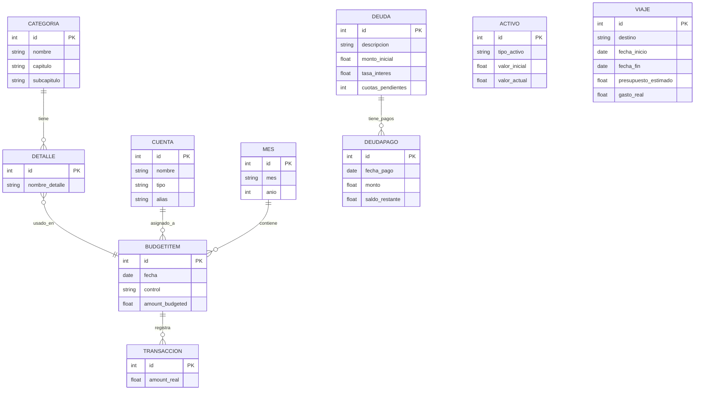

## Hoja de ruta para replicar “Presupuesto 2025” en una aplicación web

Este documento describe los pasos necesarios para convertir el Excel “Presupuesto 2025.xlsx” en una aplicación web funcional.

---

### 1. Análisis y definición de requisitos

1. **Objetivos del proyecto**:

   - Digitalizar el control financiero mensual (ingresos, egresos, ahorros).
   - Gestionar categorías, cuentas, deudas, activos y viajes.
   - Generar reportes y gráficos de estado financiero consolidado.

2. **Usuarios y roles**:

   - **Administrador**: configura categorías, cuentas y parámetros.
   - **Usuario estándar**: registra transacciones y visualiza reportes.

3. **Funcionalidades clave**:

   - Gestión de **Datos** (categorías, cuentas, detalles).
   - Módulo mensual de **Transacciones** (ingresos/egresos).
   - **Estado financiero** consolidado.
   - Gestión de **Deudas**, **Activos** y **Viajes**.
   - Importación inicial de datos desde Excel.
   - Filtrado, búsqueda y generación de reportes (tablas y gráficas).

---

### 2. Diseño de arquitectura

- **Frontend**: SPA con **Next.js** o React, usando **Tailwind CSS + shadcn/ui**.
- **Backend y Base de Datos**: **Supabase** (PostgreSQL como servicio + Auth + Realtime + Storage).
- **Autenticación**: Supabase Auth (email/password, OAuth), integrado directamente en el cliente con `@supabase/supabase-js`.
- **Importación de Excel**: Script Node.js con **SheetJS** que utiliza `supabase-js` para insertar o hacer *upsert* de la data inicial.

---

### 3. Modelo de datos conceptual

| Entidad     | Descripción                                                                 |
| ----------- | --------------------------------------------------------------------------- |
| Categoría   | Nombre, capítulo, subcapítulo                                               |
| Cuenta      | Nombre, tipo, alias                                                         |
| Detalle     | Ítem específico, asociado a Categoría                                       |
| Mes         | Identifica mes y año                                                        |
| BudgetItem  | Vincula Mes, Categoría/Detalle, Cuenta, monto presupuestado, control, fecha |
| Transacción | Vincula BudgetItem y Mes, monto real                                        |
| Deuda       | Descripción, monto inicial, tasa, cuotas pendientes                         |
| DeudaPago   | Fecha de pago, monto, saldo restante                                        |
| Activo      | Tipo de activo, valor inicial, valor actual                                 |
| Viaje       | Destino, fechas, presupuesto estimado, gasto real                           |

---

### 4. Diseño de la base de datos (Supabase)

1. **Crear proyecto** en Supabase y obtener URL y claves.
2. **Definir tablas** mediante SQL o migraciones CLI:
   - `categorias`, `detalles`, `cuentas`, `meses`, `budget_items`, `transacciones`, `deudas`, `deuda_pagos`, `activos`, `viajes`.
3. **Configurar Row Level Security (RLS)** en cada tabla:
   - Políticas para que cada usuario acceda solo a sus datos (`auth.uid() = user_id`).
4. **Migraciones**: versionar esquema con `supabase migration`.
5. **Extensiones y RPC**:
   - Instalar extensiones útiles (e.g., `pg_cron`).
   - Crear funciones SQL para cálculos (amortización, resumen financiero) y exponerlas como RPC.
6. **Índices**: en columnas de uso frecuente (`fecha`, `categoria_id`, `cuenta_id`).
7. **Storage** (opcional): usar para guardar reportes PDF/Excel.

#### 4.1. Diagrama Entidad-Relación



---

### 5. Desarrollo del backend con Supabase

1. **Desplegar proyecto** en Supabase, configurar credenciales (URL, `anon` y `service_role` keys).
2. **Configurar Supabase Auth** y manejar tokens en el cliente con `@supabase/supabase-js`.
3. **Definir RPC**:
   - `get_monthly_budget`, `upsert_transaction`, `get_financial_summary`, etc.
4. **Scripts de importación**:
   - Leer Excel con SheetJS y usar `supabase.from('...').upsert()`.
5. **Realtime**:
   - Suscripciones con `supabase.from('table').on('INSERT|UPDATE', ...)` para UI en vivo.
6. **Edge Functions** (opcional):
   - Lógica asíncrona (envío de notificaciones, cálculos programados).
7. **Versionamiento**:
   - Mantener migrations y definiciones de RPC en Git con Supabase CLI.

---

### 6. Desarrollo del frontend

1. **Inicializar proyecto** con Next.js.
2. **Instalar Tailwind CSS** y configurar **shadcn/ui**.
3. **Configurar cliente Supabase**:
   ```js
   import { createClient } from '@supabase/supabase-js';
   const supabase = createClient(
     process.env.NEXT_PUBLIC_SUPABASE_URL,
     process.env.NEXT_PUBLIC_SUPABASE_ANON_KEY
   );
   ```
4. **Autenticación y guardias** de ruta con Supabase Auth.

#### 6.1 HomePage

- Cargar resumen con RPC `get_financial_summary`.
- Mostrar cards de Ingresos, Gastos, Patrimonio.
- Gráfica anual con datos de Supabase.

#### 6.2 MonthPage

- Ruta dinámica `/mes/[mes]`.
- Fetch inicial:
  ```js
  const { data: items } = await supabase
    .from('budget_items')
    .select('*')
    .eq('month', mes);
  const { data: trans } = await supabase
    .from('transacciones')
    .select('*')
    .eq('mes', mes);
  ```
- **Unir datos** y renderizar tabla con shadcn/ui.
- **Upsert real**:
  ```js
  await supabase.from('transacciones').upsert({
    budget_item_id,
    mes,
    amount_real
  });
  ```
- Filtros con `Select`, edición inline con `Input`, guardado fila a fila.

#### 6.3 Módulos adicionales

- **Deudas**, **Activos**, **Viajes**: CRUD similar, usando `supabase.from('...')`.

---

### 7. Estilo UI/UX y diseño responsive

Basado en el sistema visual definido para SIRME, el estilo de UI/UX de “Presupuesto 2025” seguirá estos lineamientos:

#### 7.1 Filosofía de diseño

- **Minimalismo Funcional:** Interfaces limpias y foco en la tarea.
- **Glassmorphism:** Fondos semi-transparentes con `backdrop-blur`.
- **Accesibilidad:** WCAG AA, focus visible, contraste adecuado.

#### 7.2 Paleta y tipografía

- **Gradiente primario:** `from-blue-500 to-purple-600`.
- **Fondos:** `bg-gray-900` + overlays (`bg-white/10`).
- **Textos:** `text-2xl` (títulos), `text-base` (cuerpo).

#### 7.3 Componentes

- **Buttons, Inputs, Selects** de shadcn/ui con bordes `rounded-xl`, transiciones (`duration-200`).
- **Cards** con sombra ligera y hover (`hover:shadow-xl`).

#### 7.4 Layout y responsividad

- **Mobile-first**, grid adaptativo (`grid-cols-1 md:grid-cols-2 lg:grid-cols-3`).
- **Navbar** sticky/desplegable, fondo glass.

#### 7.5 Accesibilidad

- Outline visible, ARIA roles, navegación teclado.

---

### 8. Pruebas y QA

- **Unitarias:** Jest + React Testing Library.
- **Integración:** Postman o uso directo de `supabase-js` en tests.
- **E2E:** Cypress o Playwright.

---

### 9. Despliegue y operación

1. **CI/CD** con GitHub Actions:
   - Migrations de Supabase.
   - Deploy en Vercel (frontend).
2. **Infraestructura**:
   - Frontend: Vercel.
   - Supabase: servicio gestionado.
3. **Monitoreo y logs**: Integrar Sentry y dashboards de Supabase.

---

### 10. Cronograma estimado

| Fase                           | Duración estimada |
| ------------------------------ | ----------------- |
| 1. Análisis y diseño           | 2 semanas         |
| 2. Configuración Supabase      | 1 semana          |
| 3. Backend (RPC & Auth)        | 1 semana          |
| 4. Frontend (Next.js + UI)     | 3 semanas         |
| 5. Pruebas y QA                | 1-2 semanas       |
| 6. Despliegue y puesta en vivo | 1 semana          |

---

